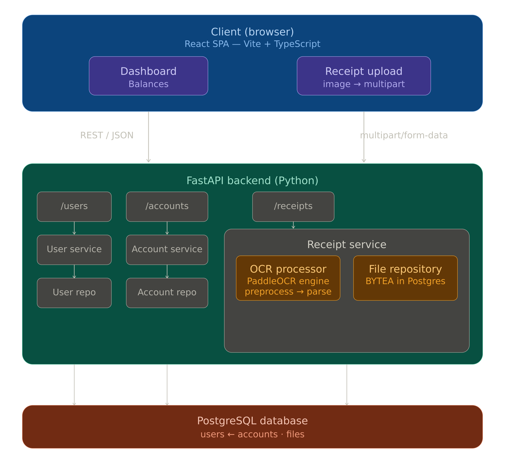

# TecaTrack Documentation

  

**Introduction**  
TecaTrack is an application designed for managing receipts and financial transactions using OCR (Optical Character Recognition) technology. Currently in a Proof of Concept (PoC) phase focusing on processing receipts from Brunbank, its main objective is to extract structured information from receipt images and automatically map it to user accounts.

---

### Repositories

This repository is the documentation hub for the TecaTrack ecosystem. Source code lives in the frontend/backend repos.

- [TecaTrack (Main)](https://github.com/FerRomMu/TecaTrack): Central wiki, documentation, and technical reports.
- [TecaTrack-Frontend](https://github.com/FerRomMu/TecaTrack-Frontend): User interface, components, and API integration.
- [TecaTrack-Backend](https://github.com/FerRomMu/TecaTrack-Backend): REST API, business logic, OCR integration, and database interaction.

---

## Features

- **Receipt Upload**: Upload images of receipts easily.
- **OCR Processing**: Automatic extraction of key data from receipt images.
- **Receipt Mapping**: Automatic association of extracted data and updating of funds.
- **Balance Dashboard**: Visualization of total and individual account balances.

---

## Premises and Requirements

- **No Authentication**: The PoC uses manual user entry. The active user is determined by an environment variable in the frontend.
- **OCR Scope**: Designed exclusively for Brunbank receipts.
- **User Identity**: Users must have a valid Argentine CUIL number.

---

## Architecture

The system follows a client-server architecture:

- **Frontend**: Single Page Application (SPA) developed with React and Vite.
- **Backend**: REST API developed in Python using FastAPI.
- **Database**: PostgreSQL for relational data persistence.

### Architecture Diagram

---

## Technologies Used

| Component      | Technology              | Reason                                                            |
| -------------- | ----------------------- | ----------------------------------------------------------------- |
| Frontend       | React, Vite, TypeScript | Dynamic interface development and strict typing                   |
| Frontend UI    | Ant Design (AntD)       | Rapid styling and component creation                              |
| Backend        | Python, FastAPI         | Robust business logic and rapid API creation                      |
| Database       | PostgreSQL, Alembic     | Relational data persistence and secure migrations                 |
| Infrastructure | PaddleOCR               | Optical Character Recognition (OCR) to extract data from receipts |

---

## Domain Vocabulary

### Main Entities

- **User**: Identified by CUIL. Can own multiple accounts and receipts.
- **Account**: Bank account linked to a user. Stores bank name, balance, and CBU. Tracks transactions.
- **File**: Binary representation of the uploaded receipt image (`BYTEA` in PostgreSQL).
- **Receipt**: Processed receipt linking user and file. Tracks OCR status and stored extracted data.
- **Transaction**: Monetary movement linking sender, receiver, source/destination accounts, and the receipt.

## Database schema

---

## Main System Workflow

1. The frontend uses the email configured in its `.env` to query the user.
2. User uploads an image of a Brunbank receipt.
3. System persists the image and processes it via the OCR service.
4. OCR extracts data, maps it to a "Receipt", and updates account balances.
5. User views updated balances on the dashboard.

---

## Important Technical Decisions

**Layered Architecture (Backend)**
Structured using `routers`, `services`, `repositories`, `schemas`, and `models` to maintain separation of concerns and allow atomic development.

**Image Persistence (Backend)**
Persisted using `BYTEA` in PostgreSQL following the KISS principle for the current PoC scope, with potential to migrate to blob storage later.

**OCR Engine Optimization**
PaddleOCR engine is initialized as a singleton at startup to prevent cold-start delays. Receipt processing runs in an async thread pool (`asyncio.to_thread`) to avoid blocking the API event loop.

**Account Matching**
Accounts are reliably matched by combining the user's CUIL with the CBU and bank name extracted from the receipt.

---

## Considerations for Future Development

- Implementation of a real authentication and authorization flow.
- Support for receipts from other financial institutions.
- Voice transaction input for logging transactions without receipts.
- Expense Reservations: setting money aside for upcoming expenses.
- Migration to dedicated blob storage (e.g., S3) for files.
- Full persistence logic for `Receipt` and `Transaction` records beyond balance updates.
