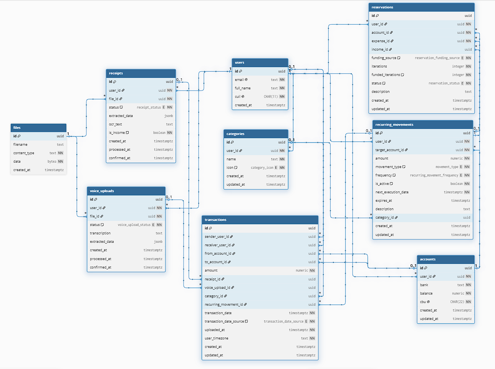
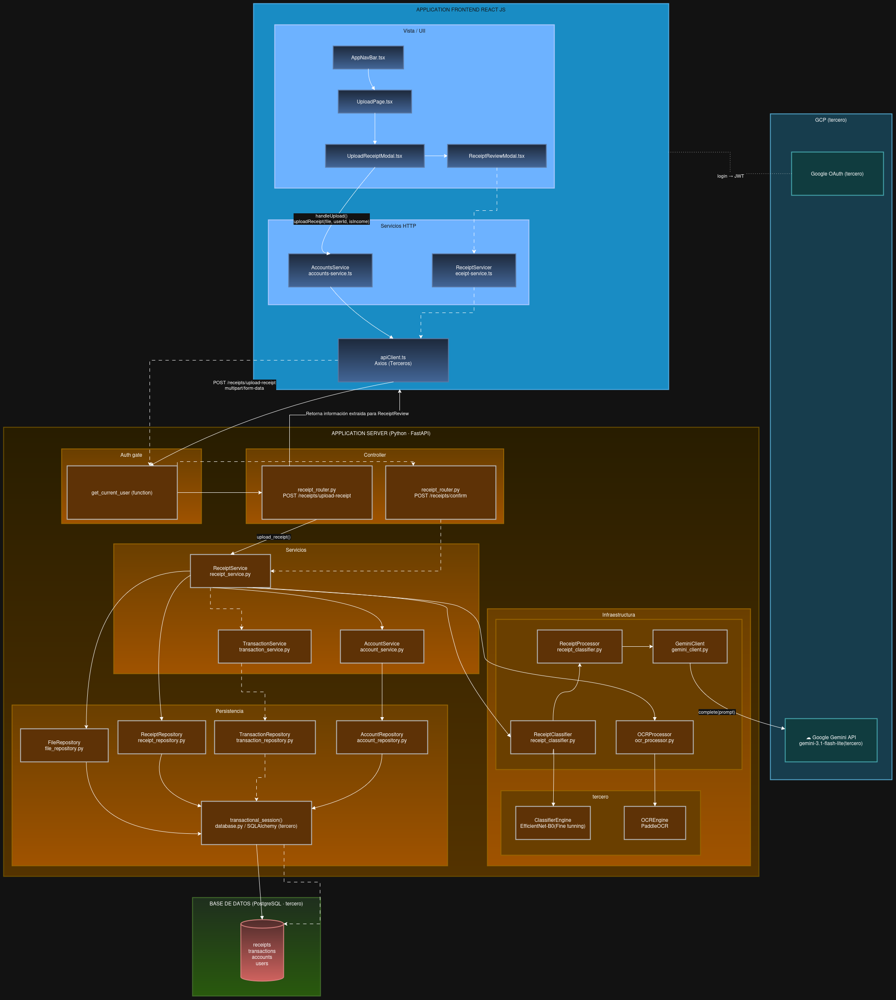

# TecaTrack Documentation

  

**Introduction**  
TecaTrack is an application for managing receipts and financial transactions using OCR (Optical Character Recognition) technology. It automatically classifies receipt images by bank, extracts structured data using bank-specific processors or an LLM-based fallback, and maps the results to the authenticated user's accounts. Receipt processing runs asynchronously in a dedicated OCR microservice, so uploads never block the user. Access is secured with Google OAuth 2.0, and users can organize their movements with personal categories. It also supports manual transaction entry, recurring income and expense scheduling, and visual statistics of movements over time. Transactions can additionally be registered by voice — a recorded audio note is transcribed and parsed into a suggested transfer for review — and users can reserve money for future expenses to see how much is really available in each account, and project their upcoming recurring expenses over time.

---

### Repositories

This repository is the documentation hub for the TecaTrack ecosystem. Source code lives in the frontend/backend repos.

- [TecaTrack (Main)](https://github.com/FerRomMu/TecaTrack): Central wiki, documentation, and technical reports.
- [TecaTrack-Frontend](https://github.com/FerRomMu/TecaTrack-Frontend): User interface, components, and API integration.
- [TecaTrack-Backend](https://github.com/FerRomMu/TecaTrack-Backend): REST API, business logic, OCR integration, and database interaction.

---

## Features

- **Authentication**: Sign in with Google (OAuth 2.0). New users complete a one-time registration by providing a valid CUIL. Sessions are backed by JWT access tokens.
- **Asynchronous Receipt Upload**: Upload images of receipts and have structured data extracted via OCR in the background. The upload returns immediately (`202 Accepted`) and the user can keep working while the receipt is processed; the extracted readout is presented for review and editing before anything is persisted.
- **Receipt List with Status**: Browse all uploaded receipts with a per-receipt status indicator (pending, waiting confirmation, processed, failed). The list polls while any receipt is still being processed.
- **Two-Phase Confirmation**: A receipt stays in `WAITING_CONFIRMATION` until the user explicitly confirms; the transaction is created and balances updated only after confirmation. Pending receipts can be confirmed inline from the list.
- **Multi-bank OCR (Microservice)**: Bank-specific processors for Brubank and Lemon, with an LLM-based (Gemini) fallback for other institutions, routed by a CNN bank classifier. OCR and classification run as a standalone OCR microservice that the main API calls over HTTP.
- **Receipt Mapping**: Extracted data is associated with the user's accounts and balances are updated accordingly.
- **Balance Dashboard**: Visualization of total and per-account balances.
- **Transaction Management**: Dedicated transactions view to browse history, filter by date range and category, and edit existing records.
- **Movement Statistics**: Statistics tab with a line chart of income vs. expenses over time (with transaction count on hover) and rankings by category and by bank as horizontal bar charts, all driven by date-range, granularity, bank, and category filters.
- **Categories**: Create personal categories with a name and icon, assign them to transactions and recurring movements, and filter by them.
- **Manual Transaction Entry**: Log income, expenses, or transfers without uploading a receipt.
- **Voice Transaction Entry**: Register a transaction by speaking instead of filling a form. A recorded audio note is transcribed by a speech-to-text engine and parsed by an LLM into a suggested transfer; processing runs in the background and the result is reviewed and confirmed before anything is saved, just like receipts.
- **Recurring Movements**: Schedule periodic income and expense entries that are registered automatically by a background worker. View, edit, filter, and deactivate them in a dedicated section, with an optional expiration date after which they stop running.
- **Money Reservations & Available Balance**: Set money aside for a future expense — funded by an account and/or a future income — without changing the real balance. Each account shows its available balance (real minus reserved), so it is clear how much can be spent without touching what has been reserved. Reservations can be created, edited, and cancelled, and close automatically when the funding income or the linked expense runs.
- **Future-Expense Projections**: Anticipate upcoming spending with a projection of active recurring expenses over a chosen period and granularity, shown as a table grouped by period and an evolution line chart.
- **Timezone-Aware Dates**: Transactions are stored in UTC and shown in the user's local timezone; future dates are rejected by the backend.
- **Account Management**: Create and switch between multiple bank accounts.

---

## Premises and Requirements

- **Authentication**: Access requires signing in with Google (OAuth 2.0). The backend issues stateless JWT access tokens, and every data endpoint resolves the active user from the bearer token.
- **User Identity**: Users must have a valid and unique Argentine CUIL number, captured during the first-time registration flow.
- **Environment Variables (Backend)**:
  - `GEMINI_API_KEY` — required for LLM-based receipt extraction (Default processor).
  - `GOOGLE_CLIENT_ID`, `GOOGLE_CLIENT_SECRET`, `GOOGLE_OAUTH_REDIRECT_URI` — Google OAuth 2.0 credentials.
  - `FRONTEND_URL` — used to redirect back to the frontend after the OAuth callback.
  - `JWT_SECRET` — signing key for access/pending tokens (must be at least 32 characters).
  - `OCR_SERVICE_URL` — base URL of the OCR microservice (default `http://localhost:8001`), validated at startup.
  - `STT_SERVICE_URL` — base URL of the STT microservice (default `http://localhost:8002`).
  - `STT_MODEL_SIZE`, `STT_DEVICE`, `STT_COMPUTE_TYPE`, `STT_LANGUAGE` — optional speech-to-text model settings (defaults: `small` / `cpu` / `int8` / `es`).

---

## Technologies Used

| Component      | Technology              | Reason                                                            |
| -------------- | ----------------------- | ----------------------------------------------------------------- |
| Frontend       | React, Vite, TypeScript | Dynamic interface development and strict typing                   |
| Frontend UI    | Ant Design (AntD)       | Rapid styling and component creation                              |
| Frontend Charts| @ant-design/charts      | Line and bar charts for the movement statistics views            |
| Frontend       | React Router DOM        | Client-side routing across app pages                              |
| Frontend       | Axios                   | Centralized HTTP client with typed error handling                 |
| Backend        | Python, FastAPI         | Robust business logic and rapid API creation                      |
| Auth           | Google OAuth 2.0 + JWT  | Delegated sign-in and stateless session tokens                    |
| Database       | PostgreSQL, Alembic     | Relational data persistence and secure migrations                 |
| OCR Microservice | PaddleOCR             | Optical Character Recognition (OCR) to extract data from receipts (runs in the standalone OCR service) |
| OCR Microservice | EfficientNet-B0 (CNN) | Identifies the originating bank from a receipt image (runs in the standalone OCR service) |
| STT Microservice | faster-whisper        | Speech-to-text transcription of voice notes (runs in the standalone STT service) |
| Infrastructure | Google Gemini (LLM)     | LLM-based receipt data extraction (fallback processor) and voice transfer extraction |

---

## Domain Vocabulary

### Main Entities

- **User**: A person using the app, identified by email and a unique CUIL. Signs in with Google and can own multiple accounts, receipts, and categories.
- **Account**: A bank account belonging to a user, holding its bank, balance, and account number (CBU). Transactions are recorded against it.
- **Category**: A user-owned label with a name and an icon, optionally assigned to transactions and recurring movements to organize and filter them.
- **File**: The uploaded receipt image kept by the system.
- **Receipt**: An uploaded receipt linked to a user and its image. It moves through a processing lifecycle (pending, waiting for confirmation, processed, or failed), keeps the data read from the image, notes whether it represents income, and records when the user confirmed it.
- **Transaction**: A monetary movement between a sender and a receiver and their source/destination accounts, optionally tied to a receipt, a category, and a recurring movement, dated in the user's timezone.
- **RecurringMovement**: A scheduled income or expense that automatically registers transactions on a defined period (weekly, biweekly, or monthly). It can be deactivated and may have an optional expiration date, description, and category.
- **Reservation**: Money a user sets aside for a specific future expense (a recurring movement), charged against one of their accounts and optionally funded by a future income. It records its funding source (account, income, or both), how many iterations of the expense it covers, and its status (active, cancelled, or fulfilled).
- **VoiceUpload**: A recorded audio note uploaded by a user to register a transaction by voice, linked to the user and its audio file. It moves through a processing lifecycle (pending, waiting for confirmation, processed, or failed), keeps the transcription and the transfer data extracted from it, and links to the transaction once confirmed.

## Database schema

---

## Upload Receipt Workflow

1. The user signs in with Google; subsequent requests carry a JWT bearer token that identifies the active user.
2. The user uploads a receipt image. The File and Receipt are persisted in `PENDING` state, the endpoint returns `202 Accepted` immediately, and OCR runs in a background task — the user can keep using the app.
3. In the background, the main API calls the OCR microservice over HTTP. The microservice's CNN classifier identifies the originating bank and the matching bank-specific processor (Brubank, Lemon, or the LLM-based Default) extracts structured data.
4. When extraction finishes, the receipt moves to `WAITING_CONFIRMATION` and the OCR readout (with suggested accounts) becomes available for review — no transaction is created yet. If extraction fails, the receipt is marked `FAILED` while the File and Receipt remain persisted.
5. The user sees the receipt status update in the receipt list and opens the pending receipt to review and edit the extracted fields, then confirms.
6. On confirmation, the system creates the transaction, updates the affected account balances, and marks the receipt `PROCESSED`.

### Architecture Diagram

### Responsabilities:

- AppNavBar.tsx
  Top-level navigation component that renders the tab bar and routes the user between the main pages of the application (Dashboard, Upload, User).

- UploadPage.tsx
  Page component that hosts the upload section. Renders the "Comprobantes" and "Manual" sub-tabs: "Comprobantes" shows the receipt list (with per-receipt status) and conditionally mounts
  UploadReceiptModal when the user triggers the upload action, while "Manual" hosts the manual transaction form. Lets the user open ReceiptConfirmModal to confirm receipts left in
  WAITING_CONFIRMATION directly from the list.

- UploadReceiptModal.tsx
  Modal component that owns the receipt upload interaction. Holds local state for the selected file and the isIncome flag, calls AccountsService.uploadReceipt() on confirmation, and reports
  success or error back to the user.

- AccountsService (accounts-service.ts)
  HTTP service layer for all account-related operations. Builds the multipart/form-data payload and delegates the actual HTTP call to apiClient. Also handles account creation and balance.

- apiClient.ts (Axios — third-party)
  Centralized Axios instance that is the single HTTP exit point of the frontend. Configured with the base URL and a response interceptor that maps backend error codes to typed ApiError objects with i18n translation.

- get_current_user (core/dependencies.py)
  FastAPI dependency that validates the JWT bearer token, ensures it is an access token, and resolves the authenticated User. Injected into every protected router so each use case operates on the identity carried by the token.

- receipt_router.py — POST /receipts/upload-receipt, POST /receipts/{receipt_id}/confirm, GET /receipts/me, GET /receipts/{receipt_id}, GET /receipts/{receipt_id}/file
  FastAPI router that receives the upload request (file and is_income flag, responding `202 Accepted`) and the later confirmation request, and exposes the receipt list (paginated, with optional status filter), the OCR readout for a single receipt, and the base64-encoded receipt image. Resolves the active user via get_current_user, resolves service dependencies via injection, and delegates to ReceiptService.

- ReceiptService (receipt_service.py)
  Central orchestrator of the asynchronous two-phase upload use case. On upload it persists the File and Receipt in PENDING state, returns immediately, and schedules a background task that calls the OCR microservice (via the classifier and OCR HTTP adapters); when extraction finishes it moves the receipt to WAITING_CONFIRMATION with its OCR readout, or to FAILED on error. On confirm it validates the edited data, creates the transaction, updates balances, and marks the receipt PROCESSED. Guarantees that File and Receipt are persisted even if extraction fails.

- TransactionService (transaction_service.py)
  Handles the business logic for creating a transaction record and applying the resulting balance delta to the source and destination accounts. Delegates persistence to TransactionRepository.

- AccountService (account_service.py)
  Resolves and validates the accounts involved in a transaction by matching the user's CUIL with the CBU and bank name extracted from the receipt. Provides concurrency-safe balance update operations.

- ReceiptClassifier (infrastructure/classifier/receipt_classifier.py) — main API
  Async HTTP adapter. Calls the OCR microservice's POST /classify to get the predicted bank type, then maps it to the matching bank-specific ReceiptProcessor (Brubank, Lemon, or the LLM-based Default). Falls back to the Default processor on any failure.

- OCRProcessor (infrastructure/ocr/ocr_processor.py) — main API
  Async HTTP adapter. Calls the OCR microservice's POST /process to obtain the raw OCR text and detected blocks, then runs the selected ReceiptProcessor locally to produce the structured OCRResponse. Returns both the structured fields and the raw text for storage.

- ReceiptProcessor + bank processors (infrastructure/ocr/processors/) — main API
  Bank-specific parsing strategies (Brubank, Lemon, Default). Apply their rules to the raw OCR text returned by the microservice and produce a structured OCRResponse. The Default processor delegates to GeminiClient.

- GeminiClient (infrastructure/llm/gemini_client.py) — main API
  Implementation of the LLMClient interface that sends a prompt to the Google Gemini API. Used exclusively by the Default processor when no bank-specific processor matches the classified receipt.

- ocr_router.py / OCRAppService (apps/ocr) — OCR microservice
  FastAPI service exposing POST /classify (runs the CNN, returns the predicted bank type) and POST /process (runs PaddleOCR, returns the raw text and detected text blocks). Performs only these two ML steps — no bank-specific parsing or LLM.

- ClassifierEngine — EfficientNet-B0 fine-tuned (third-party) — OCR microservice
  Thread-safe lazy singleton that loads and caches the fine-tuned EfficientNet-B0 model in memory. Exposes get() returning the model and class map, ensuring the model is initialized only once across all requests. Loaded in the OCR microservice lifespan, not the main app.

- OCREngine — PaddleOCR (third-party) — OCR microservice
  Thread-safe lazy singleton wrapping PaddleOCR, configured with Spanish language and text-orientation detection. Runs inference in a thread pool via asyncio.to_thread to avoid blocking the async event loop. Loaded in the OCR microservice lifespan, not the main app.

- FileRepository (file_repository.py)
  Accesses the files table and persists the raw BYTEA image data. Decoupled from receipt processing so the binary artifact is stored regardless of whether OCR succeeds.

- ReceiptRepository (receipt_repository.py)
  Accesses the receipts table. Persists the receipt record with its OCR status, raw extracted text, and is_income flag. Provides update() to reflect the final processing state after extraction completes.

- TransactionRepository (transaction_repository.py)
  Accesses the transactions table. Persists new transaction records and supports updates to existing ones, keeping monetary movements linked to the accounts and receipts they reference.

- AccountRepository (account_repository.py)
  Accesses the accounts table. Supports account creation, retrieval by CBU, and balance updates used by AccountService during transaction processing.

- transactional_session() / database.py (SQLAlchemy — third-party)
  Async context manager over SQLAlchemy's async_sessionmaker. Wraps all repository operations in a single database transaction with automatic commit on success and rollback on failure. It is the sole point of contact with PostgreSQL.

- Google Gemini API — gemini-3.1-flash-lite (third-party)
  External LLM service invoked by GeminiClient to extract structured fields from receipts that do not match a known bank processor. Receives a text prompt with the raw OCR output and returns a structured JSON response.

- PostgreSQL — receipts, transactions, accounts, users (third-party)
  Relational database that persists all application state. Accessed exclusively through transactional_session() to ensure ACID guarantees across all write operations.

---
## Important Technical Decisions

**Layered Architecture (Backend)**
Structured using `routers`, `services`, `repositories`, `schemas`, and `models` to maintain separation of concerns and allow atomic development.

**Image Persistence (Backend)**
Persisted using `BYTEA` in PostgreSQL following the KISS principle, with potential to migrate to dedicated blob storage later.

**OCR as an Independent Microservice**
OCR and bank classification were extracted from the main API into a standalone FastAPI service (`apps/ocr/`) that the main app calls over HTTP (`OCR_SERVICE_URL`). This isolates the heavy ML models (PaddleOCR, EfficientNet-B0) so they can be scaled and maintained independently without affecting the rest of the system. The main app talks to it through async HTTP adapters (`OCRProcessor`, `ReceiptClassifier`).

**Asynchronous Receipt Processing**
Reading a receipt can take time, so extraction is decoupled from upload: `POST /receipts/upload-receipt` persists the receipt in `PENDING` and returns `202 Accepted` immediately, then a background task calls the OCR microservice and updates the receipt to `WAITING_CONFIRMATION` (or `FAILED`). The user keeps working and tracks progress through the receipt list, which polls while any receipt is still pending.

**OCR Engine Optimization**
Within the OCR microservice, the PaddleOCR and classifier engines are initialized as singletons at startup to prevent cold-start delays, and inference runs in an async thread pool (`asyncio.to_thread`) to avoid blocking the service's event loop.

**Account Matching**
Accounts are reliably matched by combining the user's CUIL with the CBU and bank name extracted from the receipt.

**CNN-based Bank Classifier**
A convolutional neural network classifies the receipt image to determine the originating bank before OCR processing, enabling routing to the correct processor without manual input.

**Bank-specific Processor Architecture with LLM Fallback**
Each supported bank (Brubank, Lemon) has a dedicated OCR processor with tuned configuration. Unrecognized banks fall through to a Default processor that uses Google Gemini to extract receipt data via an LLM prompt.

**Delegated Authentication with Stateless Tokens**
Sign-in is delegated to Google (OAuth 2.0), avoiding local credential storage. The backend issues stateless JWT access tokens, and new users are onboarded through a short-lived pending token that requires a valid, unique CUIL before the account is created.

**Two-Phase Receipt Confirmation**
OCR can misread a receipt, so extraction and persistence are decoupled: once background processing finishes, the receipt is stored in `WAITING_CONFIRMATION` with its extracted data, and the transaction is only created after the user reviews, edits, and explicitly confirms (which can be done inline from the receipt list).

**Recurring Movement Generalization**
Instead of a separate model for expenses, the original "recurring income" concept was generalized to "recurring movement" with a `movement_type` (INCOME/EXPENSE), so incomes and expenses share the same scheduling, editing, and deactivation logic without duplication. Entries also gained an `is_active` flag and an optional `expires_at` date.

**Timezone Policy**
Timestamps are stored in UTC; the frontend sends ISO 8601 dates with an explicit offset plus the user's IANA timezone, and the backend (not the client clock) is the authority for rejecting future dates.

**User-Scoped Categories**
Categories belong to individual users and behave identically across transactions and recurring movements; a movement can only reference a category owned by the same user.

**Speech-to-Text as an Independent Microservice**
Voice transcription runs in a standalone faster-whisper service (`apps/stt/`) that the main API calls over HTTP (`STT_SERVICE_URL`), keeping the heavy STT model out of the main app — mirroring the OCR microservice split. A spike compared alternatives (Whisper, faster-whisper, and hosted providers), favoring open or openly consumable models to avoid overloading local machines' RAM.

**Asynchronous Voice Processing Without Automatic Transactions**
Like receipts, audio is processed in the background (transcription plus LLM extraction) and never creates a transaction on its own; the result always waits for the user to review and confirm. The confirmation flow reuses the receipt pattern (backend polling plus a validation modal with pre-filled data) for a consistent experience.

**Reservations Without Moving the Real Balance**
Instead of debiting the balance, reservations introduce an available balance (real balance − reserved). The real balance never changes, so the user clearly sees how much can be spent without touching what has already been set aside. An account-funded reservation reduces availability from creation; an income-funded one only affects it once the income executes.

**Reservation Amount Tied to the Future Expense**
A reservation's amount is not entered by hand; it is computed as N × the amount of the linked future expense, keeping the reservation consistent with the plan and avoiding arbitrary figures.

**Future-Expense Projections**
Active expense recurring movements are projected forward over a time window and granularity so users can anticipate upcoming spending, presented as a table grouped by period and an evolution chart that shares the transaction-statistics view's range and granularity controls.

**Frontend Testing Stack**
The frontend adopted Vitest + React Testing Library + MSW as its testing base, with shared conventions (AAA structure, a render helper with providers, module-level context mocks, and network interception via MSW) so coverage can grow consistently.

**Accessibility (WCAG 2.1 AA)**
The main pages were brought toward WCAG 2.1 AA — color contrast, semantic HTML and landmarks, form accessibility, and keyboard operability — centralizing color fixes in the theme tokens, with axe-core and Lighthouse audits during development.
